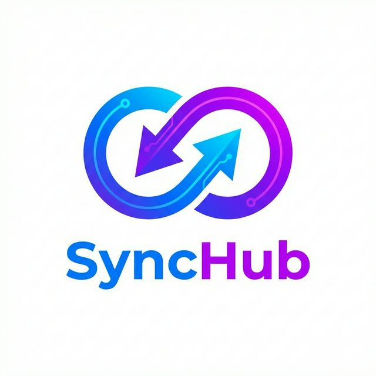
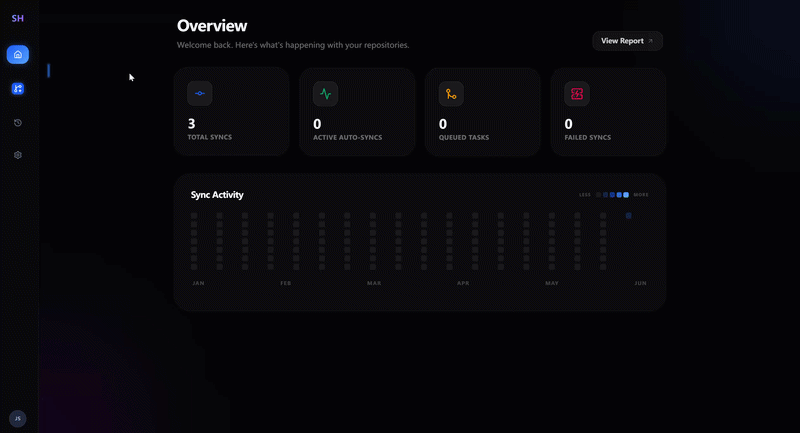

<p align="center">
  
</p>

<h1 align="center">SyncPulse</h1>

<p align="center">
  <strong>一键将 GitHub 仓库镜像同步至 Gitee | Mirror GitHub Repositories to Gitee with One Click</strong>
</p>

<p align="center">
  <a href="https://github.com/Ei-Ayw/SyncPulse/stargazers"></a>
  <a href="https://github.com/Ei-Ayw/SyncPulse/network/members"></a>
  <a href="https://github.com/Ei-Ayw/SyncPulse/blob/main/LICENSE"></a>
  
</p>

<p align="center">
  
</p>

---

## 📖 简介 / Introduction

**SyncPulse** 是一款专为开发者设计的自动化仓库同步平台。它致力于解决 GitHub 访问不稳定或需要国内备份的痛点，通过优雅的 UI 和强大的异步任务流，让您的代码在 GitHub 与 Gitee 之间自由流动。

**SyncPulse** is an automated repository synchronization platform designed for developers. It addresses the pain points of unstable GitHub access or the need for domestic backups. With an elegant UI and robust asynchronous task flows, it keeps your code flowing seamlessly between GitHub and Gitee.

---

## ✨ 主要功能 / Key Features

- 🔄 **全量镜像同步 (Mirror Sync)**: 采用 `git clone --mirror` 技术，完整克隆所有分支、标签 (Tags) 和提交历史。
- 🔑 **OAuth 2.0 联动**: 支持 GitHub 和 Gitee 的 standard OAuth 登录，安全高效地管理您的仓库权限。
- 🏗️ **自动初始化仓库**: 如果 Gitee 目标仓库不存在，SyncPulse 将利用 API 为您自动创建并配置。
- 📊 **实时监控面板**: 苹果风格 (Glassmorphism) 的 UI 设计，集成 GitHub 风格的同步活跃度热力图。
- ⚡ **高性能异步处理**: 基于 Celery + Redis，处理大规模仓库搬家时不会阻塞页面，且支持失败重试。

---

## 🛠️ 技术栈 / Tech Stack

| 库/框架 Library/Framework | 用途 Usage |
| :--- | :--- |
| **FastAPI** | 高性能异步后端 API |
| **React (Vite)** | 现代前端工程化方案 |
| **Tailwind CSS** | 响应式精致样式设计 |
| **Framer Motion** | 流畅的微交互动画 |
| **Celery & Redis** | 分布式异步任务队列 |
| **MySQL & SQLAlchemy** | 数据持久化与 ORM |

---

## 🚀 快速开始 / Quick Start

### 1. 环境准备 / Prerequisites
确保您的机器上已安装：
- **Python** 3.9+
- **Node.js** 18+
- **MySQL** 8.0+
- **Redis**

### 2. 配置环境变量 / Configuration
在 `backend/` 目录下根据 `.env.example` 创建 `.env` 文件，并填写您的 OAuth 密钥。
Create a `.env` file in the `backend/` directory based on `.env.example` and fill in your OAuth credentials.

### 3. 启动项目 / Run Locally

**后端 / Backend:**
```bash
cd backend
python -m uvicorn app.main:app --reload
```

**启动任务工人 / Worker:**
```bash
cd backend
python -m celery -A app.worker.celery_app worker --loglevel=info --pool=solo
```

**启动定时任务 / Beat Scheduler:**
*(需要在新的终端窗口中运行 / Run in a new terminal)*
```bash
cd backend
python -m celery -A app.worker.celery_app beat --loglevel=info
```

**前端 / Frontend:**
```bash
cd frontend
npm install
npm run dev
```

---

## 🗺️ 路线图 / Roadmap

- [ ] 支持同步全量 Repositories (一键搬家)
- [ ] 定时自动同步任务 (Cron Jobs)
- [ ] Webhook 触发同步
- [ ] 飞书/钉钉 同步成功通知
- [ ] 支持更多的 Git 平台 (GitLab, Bitbucket)

---

## 🤝 参与贡献 / Contributing

我们非常欢迎各种形式的贡献！无论是提交 Bug 反馈、功能建议还是 Pull Request。
We welcome all forms of contribution! Whether it's bug reports, feature suggestions, or pull requests.

1. Fork 本项目
2. 创建您的特性分支 (`git checkout -b feature/AmazingFeature`)
3. 提交您的更改 (`git commit -m 'Add some AmazingFeature'`)
4. 推送到分支 (`git push origin feature/AmazingFeature`)
5. 开启一个 Pull Request

---

## 📜 开源协议 / License

本项目采用 [MIT License](LICENSE) 开源。

## ⭐️ 感谢支持 / Support

如果这个项目对你有帮助，请给一个 **Star** 吧！这对我们意义重大。
If this project helps you, please give it a **Star**! It means a lot to us.
